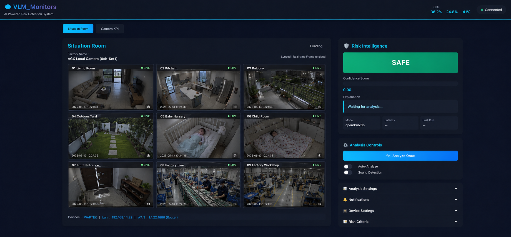

# 把家裡不要的手機都拿來當監控吧！

把舊手機、備用手機、平板，直接變成家裡或工作場域的監控鏡頭；再用一台有算力的 Linux 主機集中接收畫面、切換來源、做本地 VLM 風險分析，真的有狀況時再送出通知。



這個專案現在解的核心痛點很直接：

- 舊手機不要丟，直接拿來當 `Camera SRC`
- 多支手機畫面集中進同一個 `Situation Room`
- 只用一台有算力的 service host 跑 Ollama VLM
- 想分析哪一支畫面，就即時切換指定來源
- 不想把影像送上雲，就維持本地優先架構

目前正式 runtime 是 Flask + Socket.IO + MediaMTX + Ollama，主入口是 `src/server.py`，不是舊的 Streamlit 路徑。

## Agent Onboarding First

這個 repo 內建可分享的 onboarding skill：

- [`skills/project-spec-onboarding/SKILL.md`](./skills/project-spec-onboarding/SKILL.md)

如果你是第一次接手這個專案，或想讓 agent 快速理解它，先讓 agent 用這個 skill，從 `./spec/PROJECT_MAP.md` 開始，而不是先盲掃整個 codebase。

範例提示詞：

```text
請利用 $project-spec-onboarding，去初始化理解這整包專案，先從 ./spec/PROJECT_MAP.md 開始，再告訴我這個專案目前的核心架構、執行方式、以及之後修改時應該優先看哪些文件。
```

English example:

```text
Use $project-spec-onboarding to initialize understanding of this repository. Start from ./spec/PROJECT_MAP.md, then summarize the current architecture, runtime flow, and which docs/files should be read first before making changes.
```

## 你會得到什麼

- `Situation Room`：集中監看多支手機 / 瀏覽器來源
- `Camera SRC`：手機開 HTTPS 頁面就能當分享鏡頭
- 本地 Ollama VLM：只分析當前指定來源，不必所有來源一起燒算力
- 遠端 HTTPS：可選 `ngrok` 或 `Tailscale`
- Optional alerts：SMS / webhook
- Optional sound detection

## Architecture

```text
local / phone camera
  -> Camera SRC browser publish
  -> MediaMTX
  -> shared Situation Room grid
  -> selected source only
  -> Ollama VLM analysis
  -> UI updates / alerts

service host local camera
  -> GStreamer capture
  -> CameraThread
  -> FFmpeg RTSP publish
  -> MediaMTX
  -> RTSP / HLS / WebRTC
```

## Prerequisites

Required:

- one Linux service host with enough compute to run local vision models
- Docker
- Docker Compose
- NVIDIA container runtime configured for Docker on the currently tested path
- Ollama installed on the host and reachable at `http://localhost:11434`
- USB camera available at `/dev/video0`
- `temp/mediamtx` present and executable

Optional:

- `ngrok`: simple HTTPS tunnel for phone access
- `Tailscale`: better long-running remote-access path
- Twilio credentials: only needed for SMS alerts
- webhook endpoint: only needed for webhook alerts

## Ollama Setup

Start Ollama on the host:

```bash
ollama serve
```

Recommended first model:

```bash
ollama pull bakllava
```

Other usable vision model suggestions:

- `bakllava`
- `minicpm-v:8b`
- `llama3.2-vision:11b`
- `qwen3-vl:8b`

## Tunnel Setup

`run.sh` now supports two HTTPS paths for phone / remote browser usage:

- `ngrok`
- `Tailscale`

When you run `./run.sh up` or `./run.sh down_up`, the script can prompt you to choose one with left/right arrow keys.

### ngrok

Install and authenticate once:

```bash
ngrok config add-authtoken <YOUR_NGROK_AUTHTOKEN>
```

The script will create:

- `Public UI`: HTTPS browser UI
- `Public RTC`: HTTPS MediaMTX publish/playback base

### Tailscale

Typical setup:

```bash
curl -fsSL https://tailscale.com/install.sh | sh
sudo tailscale up
```

If operator permission is missing, `run.sh` can now detect that and ask whether it should run the required `sudo tailscale set --operator=...` and `sudo tailscale funnel ...` commands for you.

## Quick Start

`./run.sh up` already performs preflight checks. If Docker, Ollama, MediaMTX, camera devices, NVIDIA runtime, ngrok, or Tailscale prerequisites are missing, it stops early and prints what to install or verify.

Start the full stack:

```bash
./run.sh up
```

Restart cleanly:

```bash
./run.sh down_up
```

Force a tunnel mode without using the arrow-key prompt:

```bash
./run.sh up --ngrok
./run.sh up --tailscale
./run.sh up --no-tunnel
```

Check runtime health:

```bash
./run.sh status
```

Follow logs:

```bash
./run.sh logs
```

Stop:

```bash
./run.sh down
```

## URLs

Local:

- UI: `http://localhost:5000`
- RTSP: `rtsp://localhost:8554/camera`
- HLS: `http://localhost:8888/camera/index.m3u8`

Remote / phone:

- use the HTTPS `Public UI` printed by `./run.sh up`
- do not manually browse to `Public RTC`

## How To Use

### Service Host

1. Open `http://localhost:5000`
2. Enter `Situation Room`
3. Wait for local and remote source tiles to appear
4. Choose which source to monitor
5. Use `Analyze Once` or `Auto Analysis`

### Phone As Camera SRC

1. Open the HTTPS `Public UI`
2. Enter `Camera SRC`
3. Fill in source name / source id
4. Press `Start Camera Sharing`
5. Grant camera permission
6. Start publishing from the opened publisher page

### Phone As Shared Situation Room Client

1. Open the HTTPS `Public UI`
2. Enter `Situation Room`
3. View the shared dashboard
4. Be aware that source selection affects the same backend state as the service host

## Docs

Read these first:

- [`spec/PROJECT_MAP.md`](./spec/PROJECT_MAP.md)
- [`spec/ARCHITECTURE.md`](./spec/ARCHITECTURE.md)
- [`spec/RUNTIME.md`](./spec/RUNTIME.md)
- [`spec/SITUATION_ROOM.md`](./spec/SITUATION_ROOM.md)
- [`spec/TROUBLESHOOTING.md`](./spec/TROUBLESHOOTING.md)
- [`spec/TODO.md`](./spec/TODO.md)
