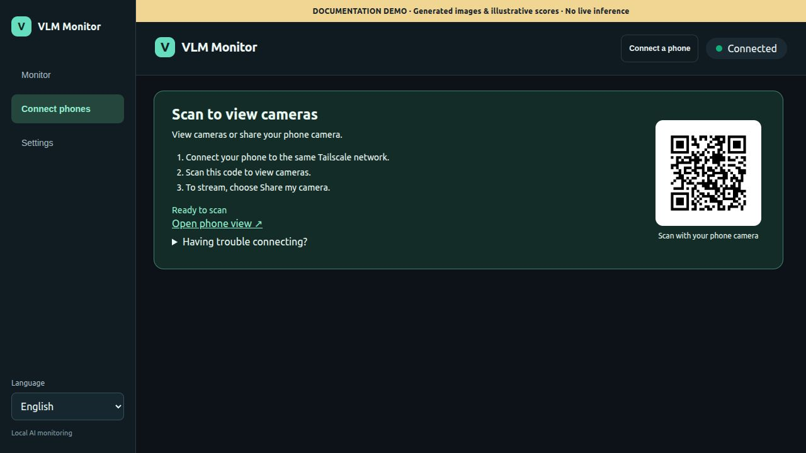
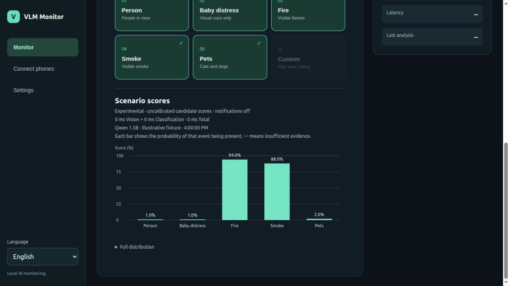
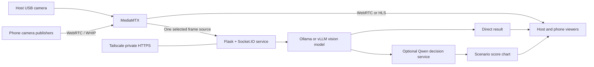

# VLM Monitor

**One local AI host. Cameras from your webcam and phones. A shared view from anywhere in your Tailnet.**

Turn a Linux computer into a camera monitoring service. Connect a USB camera, let phones join by QR code, and choose what the AI should look for using scenario cards or your own prompt. The host runs inference; phones can watch, share their cameras, or do both.

[Quick start](#quick-start) · [Phone setup](#connect-an-iphone-or-another-phone) · [Scenario scores](#multi-scenario-scores-experimental) · [中文介紹](#繁體中文快速介紹) · [Technical docs](#documentation)


*Real WebUI rendered with documentation fixtures. Camera images are AI-generated; scores are illustrative, not model predictions. All demo QR codes point to an example URL, not a live camera.*

## What you can do

- **Watch multiple cameras:** host webcam and phone streams in one dashboard.
- **Use a phone as a camera:** scan the QR code, open the client page, and explicitly start sharing. Other connected devices can watch it.
- **Choose a scenario:** person, visible baby distress, fire, smoke, pet, or a custom prompt.
- **Compare scenario scores:** experimental multi-select mode shows one compact chart: scenario names on X, presence score on Y.
- **Switch inference at runtime:** choose an available Ollama or vLLM vision model in Settings.
- **Use your language:** English by default, with Traditional Chinese, Japanese and Korean.
- **Keep AI on the host:** browser clients do not need to install an LLM. Viewing video does not start continuous AI monitoring.

## Quick start

### Supported host profiles

| Profile | Current status |
| --- | --- |
| Ubuntu/Debian x86_64 + NVIDIA GPU | Native service path tested locally on an RTX 2080 Ti, 11 GB |
| Linux aarch64 / Jetson | Architecture-aware bootstrap; GPU packages depend on the board/JetPack. Not validated by the latest x86 test session |
| vLLM | Optional pinned x86 CUDA 12.6 compatibility profile; an existing compatible remote endpoint can also be configured |
| Phone / tablet / laptop | Browser client; iOS uses the HTTPS page, no native iOS app included yet |

You need Python 3.10+, a Linux user session with systemd, and a supported camera. The bootstrap prepares Python dependencies, MediaMTX, Ollama, a default vision model and Tailscale. It may ask for `sudo`, download model weights and require a Tailscale sign-in.

```bash
git clone https://github.com/a0665x/VLM_Monitors.git
cd VLM_Monitors
./run.sh
```

Choose **`a` — first-time host and phone setup**. Alternatively choose **`1` — x86_64** or **`2` — aarch64** for explicit installation, then **`3` — start service**. The architecture must match the machine you are installing on.

Open **[http://127.0.0.1:5000](http://127.0.0.1:5000)** on the host. Select a camera and a scenario, then **Analyze once** or **Start monitoring**. Stop monitoring when you are done.

For scripted installation and operation:

```bash
bash scripts/bootstrap-local.sh --arch "$(uname -m)"
./run.sh local-up
./run.sh local-status
./run.sh local-logs
# After changing .env:
./run.sh local-restart
# Stop and disable the web/camera service:
./run.sh local-down
```

The native service starts with the user's systemd session. Running before login or after logout needs user lingering; see [service operations](spec/SERVICE.md). Existing Jetson/Docker commands (`up`, `down`, `status`, `logs`) are a separate legacy deployment profile, not aliases for `local-*`.

## Connect an iPhone or another phone

1. Install and connect **Tailscale** on the host and phone, using the same Tailnet with permission to access the host.
2. Enable private HTTPS on the host, through the setup menu or:

   ```bash
   sudo tailscale up
   sudo tailscale serve --bg --https=443 http://127.0.0.1:5000
   ./run.sh local-restart
   ```

3. On the host, choose **Connect phones**. Scan the QR code with the phone camera; it opens **`/join`**.
4. Choose **Watch all cameras**, or **Share my camera**, allow camera access, and press **Start sharing**. You can switch back to watching while your camera continues sharing.

<table>
<tr><th>After scanning: watch host and phone cameras</th><th>Share this phone's camera</th></tr>
<tr><td></td><td></td></tr>
</table>

*Mobile viewport captures of the actual browser client, not photographs of an iPhone or proof of a physical iOS test. Images are generated examples; the preview does not start a real camera.*

- This is a **private Tailnet connection**, not a public video link. A QR code is a URL shortcut, not an authorization mechanism.
- If the page will not open, check Tailscale on both devices and ask the Tailnet administrator to verify them in [device management](https://console.tailscale.com/admin/machines).
- Browsers can check access to the service, but cannot directly inspect whether the phone's Tailscale app is enabled.
- WebRTC media needs allowed connectivity to host UDP/TCP **8189**. **HLS compatibility playback** is available if WebRTC cannot connect; it may add several seconds of latency.
- iOS camera sharing needs HTTPS, camera permission, the browser in the foreground and the screen awake. Locking the phone or switching apps can interrupt the stream.
- There is currently no separate application login or per-user permission layer. Use trusted Tailnet access; do not expose this service publicly as if it were a multi-tenant product.



*Documentation QR only. Your running service generates its own Tailnet URL.*

## Pick an analysis mode

| Mode | Input and output | Use it for |
| --- | --- | --- |
| **Single scenario · Vision** | One card or custom prompt → visual model → yes/no and explanation | A specific question or custom behavior |
| **Multi-scenario · Parallel classifier** | Multiple cards → visual observations → Qwen 1.5B → present/absent/unknown candidate scores | Exploring several predefined scenarios together |

Changing modes does not start monitoring. Single mode automatically uses one selected card; you do not need to manually deselect every card from multi-mode. Settings changes are checked before applying; unavailable services preserve the previous setting and show an error.

Only **one selected source** is analyzed at a time. Host AI selection is shared; a phone's ordinary viewing selection is independent. Simultaneous inference on every camera is not implemented.

### Multi-scenario scores (experimental)




*These two screenshots demonstrate chart behavior with hand-authored fixture values and generated scenes. They are not measured detections, accuracy results or calibrated probabilities.*

The implementation is inspired by **Jev / RLCD-style bounded decisions**. It is **not an integration with TypeSafe's hosted Jev service**, and does not use an RLCD-trained checkpoint. The community [Qwen-2.5-1B-RLCD repository](https://huggingface.co/harshatheg/Qwen-2.5-1B-RLCD) informed the investigation; this project runs its own local classifier using **Qwen2.5-1.5B-Instruct**.

```text
Selected camera frame
        │
        ▼
Vision model (Ollama or vLLM)
        │  scenario-specific text observations
        ▼
Local PyTorch Qwen 1.5B classifier
        │  batched A/B/C candidate scoring
        ▼
Present / absent / unknown for each selected scenario
        │
        ▼
Bar chart + expandable full distribution
```

The text classifier cannot accept an arbitrary image embedding. The vision model supplies the visual evidence first. Missing or uncertain evidence is shown as **—**, not a fabricated zero. Each bar is that scenario's *presence candidate score*; scores across different scenarios do **not** sum to 100%, because a person and a pet can both be present.

Prepare a separate Python environment with host-compatible PyTorch, then:

```bash
python3 -m venv .venv-decision
# Install PyTorch appropriate for your CUDA / CPU / Jetson platform first.
.venv-decision/bin/pip install -r requirements-decision.txt
./run.sh decision-up
```

In **Settings → Analysis mode**, check service readiness and choose multi-scenario mode. The launcher can also reuse a prepared `.venv-vllm` interpreter; that does not start vLLM. First startup downloads official Qwen weights under ignored `temp/huggingface/`.

```bash
./run.sh decision-status
./run.sh decision-logs
./run.sh decision-down
```

**Limits:** scores are uncalibrated, the classifier cannot recover evidence missed by the vision model, and this version does not share prefix KV caches. The experimental mode does not trigger notifications. Visible baby distress is a visual cue, not audio crying detection. This is an experimental monitoring tool, not a certified fire alarm or baby safety system.

A local five-scenario functional sample took **1,128 ms** (vision 856 ms, decision 238 ms). It is one warm sample, not a benchmark or a speedup guarantee; adding a second model can also be slower. See [implementation and validation](spec/STRUCTURED_DECISIONS.md).

## Engines, settings and GPU use

The **vision engine** and **analysis mode** are separate settings. Ollama/vLLM serves the image model; the experimental text decision stage uses its own PyTorch service.

| Component | Default / setup |
| --- | --- |
| Ollama | `qwen2.5vl:3b`, `http://127.0.0.1:11434` |
| vLLM (optional) | Install with menu `6`, start with `./run.sh vllm-up`, select it in Settings after it becomes ready |
| Experimental classifier | `Qwen/Qwen2.5-1.5B-Instruct`, loopback port `8001` |
| Host settings | Copyable defaults in [`config/local.env.example`](config/local.env.example) |
| vLLM settings | [`config/vllm.env.example`](config/vllm.env.example) |

Runtime engine/model settings persist in `temp/engine-settings.json`; analysis mode in `temp/decision-settings.json`. Environment changes require `local-restart`; supported UI changes apply without restarting.

- **Viewing video does not enable AI monitoring.** Desktop rendering and video playback can still use GPU resources.
- Pausing monitoring or finishing one-shot analysis requests unloading the current Ollama model and experimental classifier. A subsequent analysis incurs model reload time.
- An unavailable classifier blocks inference before the vision stage. An inference error stops automatic retries.
- vLLM reserves GPU memory while its service runs: use `./run.sh vllm-down` when finished. On a small GPU, avoid loading both engines at once.
- The header's **System GPU** metric includes all applications, including the desktop and browser.

## Architecture


```mermaid
flowchart LR
  USB[Host USB camera] --> M[MediaMTX]
  P[Phone camera publishers] -->|WebRTC / WHIP| M
  M -->|WebRTC or HLS| B[Host and phone viewers]
  M -->|One selected frame source| S[Flask + Socket.IO service]
  S --> V[Ollama or vLLM vision model]
  V --> D[Direct result]
  V --> Q[Optional Qwen decision service]
  Q --> C[Scenario score chart]
  D --> B
  C --> B
  T[Tailscale private HTTPS] --- S
```

The active entrypoint is **`src/server.py`**, launched through Gunicorn by the native service profile. Use **one worker**: camera ownership and in-memory state are shared within that process. `src/app.py` / `src/modes/` contain older alternate paths.

For a future native iOS client, start with `/api/network`, `/api/sources`, `/api/status` and the same-origin HLS paths. Socket.IO events are available but are not plain WebSockets. See [client network](spec/CLIENT_NETWORK.md) and [API reference](spec/API.md).

## Development and screenshots

```bash
.venv/bin/pip install -r requirements-dev.txt
.venv/bin/python -m pytest -q
# Isolated documentation preview, no camera or GPU inference:
.venv/bin/python scripts/docs_preview.py
# Open http://127.0.0.1:5055/ or /join
```

Latest local automated result: **62 passed, 1 skipped** (2026-09-26). Camera drivers, WebRTC across Tailnets and physical iOS behavior still need hardware/network testing.

[`docs/assets/`](docs/assets/) contains generated scenarios and UI screenshots. [`docs/DEMO_ASSETS.md`](docs/DEMO_ASSETS.md) records image prompts, fixture values, capture sizes and reproduction steps. The preview serves real UI assets with isolated fixture APIs; it does not import the production camera/model runtime. Do not treat its demo QR code as a connection link.

## Documentation

| Guide | Contents |
| --- | --- |
| [Project map](spec/PROJECT_MAP.md) | Code ownership and repository structure |
| [Service](spec/SERVICE.md) | Installation, user services, backend profiles |
| [Client network](spec/CLIENT_NETWORK.md) | QR join, publishing, playback and Tailscale |
| [WebUI](spec/WEBUI_EXPERIENCE.md) | Cards, settings and user flows |
| [Structured decisions](spec/STRUCTURED_DECISIONS.md) | Research, implementation, caveats and validation |
| [API](spec/API.md) | HTTP and Socket.IO contracts |
| [Testing](spec/TESTING.md) | Automated and hardware verification |
| [Troubleshooting](spec/TROUBLESHOOTING.md) | Runtime diagnostics |

## 繁體中文快速介紹

**一台主機跑 AI，手機掃碼就能看，也能成為新的相機。**

1. 主機執行 `./run.sh`，選首次安裝；支援 x86_64 與 aarch64 安裝入口，包含 Ollama。ARM 的 GPU 套件仍需配合硬體。
2. 手機與主機連上同一個 Tailscale 網路，掃主機頁面的 QR code。
3. 手機可「查看所有相機」或「分享我的相機」，觀看與分享可以同時進行。
4. 主機選擇一個分析來源，再用情境卡片或自訂 prompt 啟動分析。
5. 實驗多情境模式將影像轉成文字觀察，再由 Qwen 1.5B 評分；X 軸為情境、Y 軸為存在分數。這是 Jev／RLCD 概念啟發的本機實作，並非官方 Jev，分數也尚未校準。

本文截圖使用生成影像與示範分數，不是真實偵測成果。手機截圖呈現瀏覽器版介面，尚未包含原生 iOS App。測試結束請暫停監控；Ollama／分類模型會要求卸載，vLLM 則需停止其服務。
