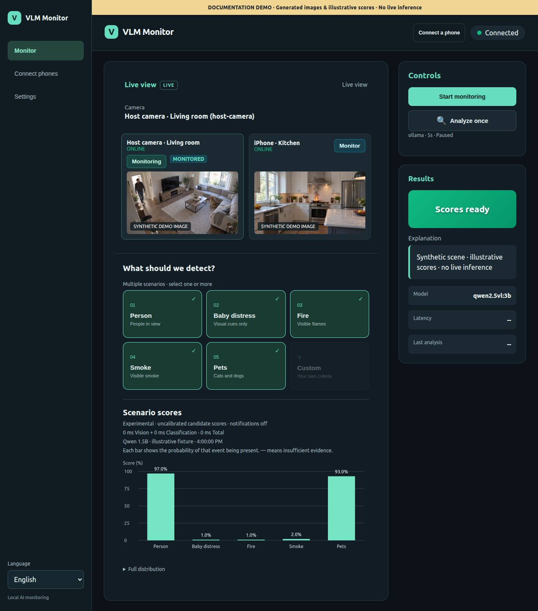
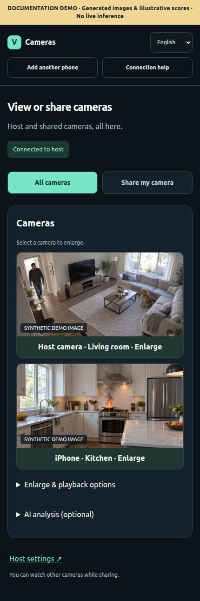
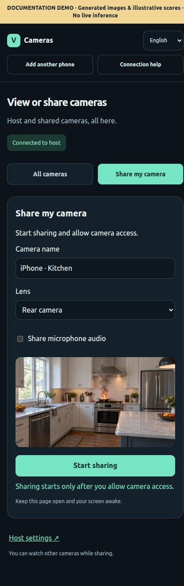
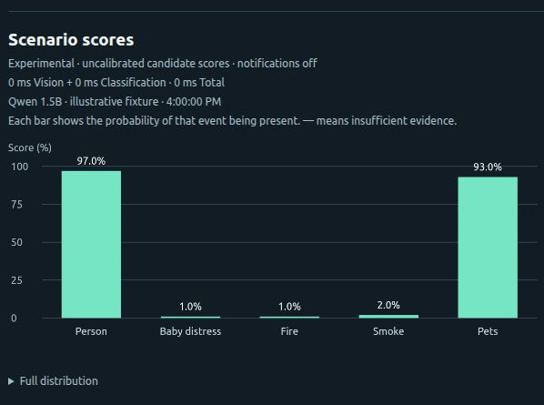
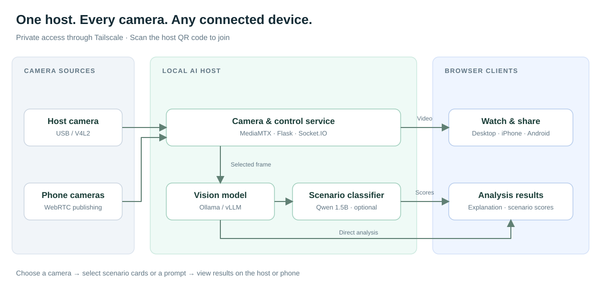

# VLM Monitor

**One AI host. All your cameras. View and share from your phone.**

Run a local camera monitoring service, connect phones by QR code, and choose what AI should detect with scenario cards or your own prompt.



## Features

- **Multiple cameras** — view host and phone cameras together.
- **Phone sharing** — scan a QR code to watch or share your camera.
- **Scenario cards** — person, baby distress, fire, smoke, pets and custom prompts.
- **Scenario scores** — compare multiple categories in one chart.
- **Runtime settings** — select Ollama or vLLM and switch models from the UI.
- **Four languages** — English, Traditional Chinese, Japanese and Korean.

## Get started

```bash
git clone https://github.com/a0665x/VLM_Monitors.git
cd VLM_Monitors
./run.sh
```

Choose **`a`** for first-time setup, or **`1` / `2`** for x86_64 / aarch64 installation. The setup prepares the host service, Ollama and phone connectivity.

Open **[localhost:5000](http://127.0.0.1:5000)** → select a camera → choose a scenario → **Analyze once** or **Start monitoring**.

## Connect your phone

1. Connect the host and phone to the same **Tailscale** network.
2. Open **Connect phones** on the host and scan its QR code.
3. Choose **All cameras** to watch, or **Share my camera** to publish the phone's view.

<table>
<tr><th>Watch cameras</th><th>Share your camera</th></tr>
<tr><td></td><td></td></tr>
</table>

## Choose what to detect

**Single scenario:** one card or a custom prompt, with a visual explanation.

**Multi-scenario:** select several cards and compare their presence scores. A vision model produces observations, then a local **Qwen 1.5B** classifier scores each category using a Jev / RLCD-inspired approach.



*Screenshots use generated scenes and illustrative scores. [Example assets](docs/DEMO_ASSETS.md).*

## How it works



[Edit diagram in draw.io](docs/diagrams/architecture.drawio)

## Useful commands

| Command | Action |
| --- | --- |
| `./run.sh local-up` | Start the host service |
| `./run.sh local-down` | Stop the host service |
| `./run.sh local-tailnet` | Enable private phone access |
| `./run.sh vllm-up` | Start the configured vLLM engine |
| `./run.sh decision-up` | Start the configured scenario classifier |

[Installation & configuration](spec/SERVICE.md) · [Phone connectivity](spec/CLIENT_NETWORK.md) · [API](spec/API.md)

## 中文簡介

**一台主機跑 AI，手機掃碼就能觀看，也能分享自己的鏡頭。**

執行 `./run.sh` 完成安裝，讓主機與手機連上 Tailscale，再掃 QR code 加入。選擇相機、情境卡片或自訂提示詞，即可開始分析；也能在設定中切換 Ollama／vLLM 模型，查看多情境分數。
